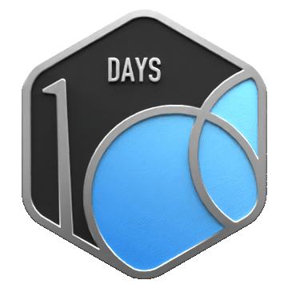

# 👋 Hi, I'm Chidurala Tejaswini!

Final-year CSE student at **IIT Dharwad** | 💻 Aspiring SDE with a passion for building intelligent, scalable software.

---

## About Me
- 🌱Currently exploring **Deep Learning(PyTorch, Transformers)**, **System Design & DSA (via LeetCode)**
- Focusing on solving real-world problems using **AI, NLP**, and **Full-Stack Web Development**.
---

## Featured Projects
- [**SDN Ryu-Controller -- Load-Balancing with Dynamic-Routing**](https://github.com/Sotejaswini/SDN-based-Load-Balancing)
  Ryu controller which performs DIJKSTRA algorithm to find best paths, based on traffic flowing through links.

- [**SmartRESUMEscan**](https://github.com/Sotejaswini/SmartRESUMEscan)
  Resume Scanner using NLP (Skill Matching & Text Classification)
  An NLP-powered tool to analyze and enhance resumes for modern tech roles

- [**AI-Sudoku-solver-OCR**](https://github.com/Sotejaswini/AI-Sudoku-Solver-OCR)  
   AI Sudoku Solver Using OCR(Computer Vision + AI)
---

 
  <h2 align="center">Leetcode Info</h2>  
  

    
    
    
    
  

 

  

---

### Tech Stack
### Languages  

### Libraries / Tools  

### Web Development  

### Tools & Platforms  

### Soft Skills  
🗣️ Communication | ⏱️ Time Management | 🤝 Team Collaboration

---

### GitHub Stats

  
  
   
  

## Let's Connect!
- Email: yonsiniwsajet17@gmail.com  
- LinkedIn: (https://www.linkedin.com/in/chidurala-tejaswini-babb63269) <!-- Replace with your actual link -->
---

## 😄 Pronouns:  
She/Her  
---

## ⚡ Fun fact:  
“Code is like humor. When you have to explain it, it’s bad.” – Cory House
